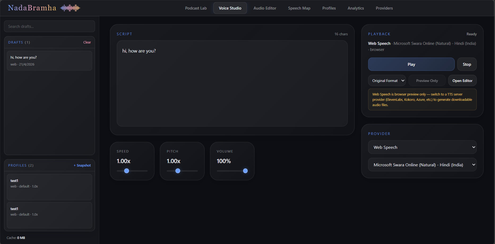
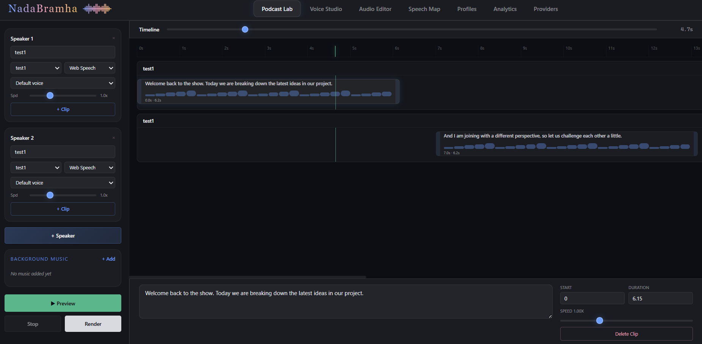
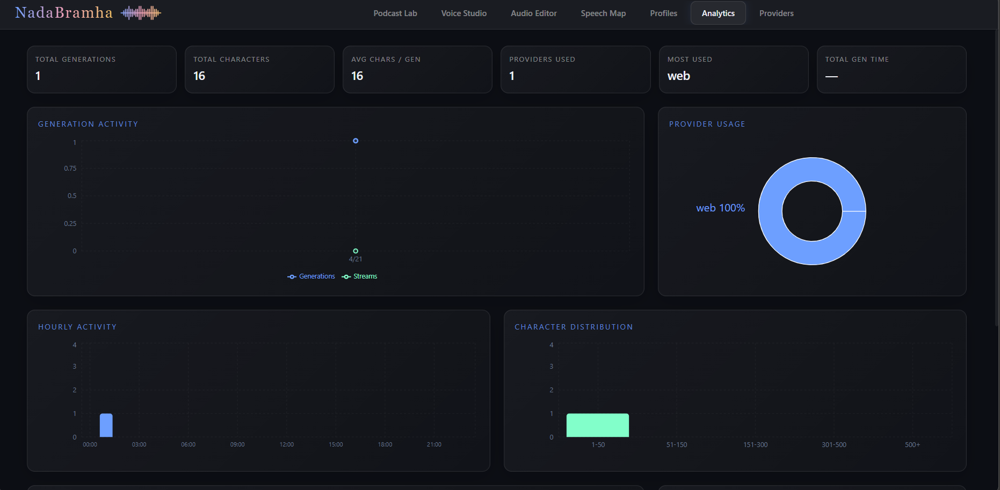

<div align="center">


# NadaBramha

**A local-first AI voice studio — from script to sound in one workspace.**

[](https://react.dev)
[](https://typescriptlang.org)
[](https://vite.dev)
[](https://tailwindcss.com)
[]()

</div>

---

## What is NadaBramha?

NadaBramha is a voice creation studio that runs entirely on your machine. It connects to multiple TTS providers, lets you compose multi-speaker podcasts on a visual timeline, mix in background music, and export everything as WAV — all from one dark-glass UI.

No cloud lock-in. No subscriptions. Just your voice stack, your way.

---

## Screenshots

<div align="center">

| Voice Studio | Podcast Lab |
|:---:|:---:|
|  |  |

| Audio Editor | Analytics |
|:---:|:---:|
|  |  |

</div>

> **Add your screenshots** to the [`screenshots/`](./screenshots) folder with the names above.  
> **Add demo videos** to the [`demo/`](./demo) folder — they'll be linked from this README automatically.

### Demo

https://github.com/user-attachments/assets/demo-placeholder

> Replace the link above with your actual uploaded video URL from GitHub.

---

## Features

| Module | What it does |
|---|---|
| **Voice Studio** | Write scripts, pick a provider & voice, tweak speed/pitch/volume, generate audio, download in WAV or native format |
| **Podcast Lab** | Multi-speaker timeline (up to 6), drag/resize/snap clips, background music with fade & loop, render to WAV |
| **Audio Editor** | Waveform visualization with WaveSurfer.js, processing tools |
| **Speech Map** | Speaker diarization for multi-speaker recordings |
| **Profiles** | Save & reuse voice presets across the app |
| **Analytics** | Real-time charts — activity timeline, provider usage, hourly heatmap, latency tracking, event log |
| **Providers** | Configure 8 TTS backends with one-click connectivity test |

### Supported Providers

`Web Speech` · `ElevenLabs` · `Azure Speech` · `AWS Polly` · `OpenAI-compatible` · `Kokoro` · `Piper` · `Generic HTTP`

---

## Quick Start

### One-command setup

**Windows (PowerShell):**
```powershell
.\setup.ps1
```

**macOS / Linux:**
```bash
chmod +x setup.sh && ./setup.sh
```

These scripts install dependencies, build the app, and start the server — you'll be up and running at `http://localhost:3901`.

### Manual setup

```bash
# Install dependencies
npm install

# Build the frontend
npm run build

# Start the server
npm run dev
```

Then open **http://localhost:3901**

---

## Tech Stack

| Layer | Tech |
|---|---|
| Framework | React 19 |
| Language | TypeScript 5.8 |
| Bundler | Vite 6 |
| Styling | Tailwind CSS 4 |
| State | Zustand 5 (persisted to localStorage) |
| Charts | Recharts |
| Audio | Web Audio API, WaveSurfer.js 7 |
| Server | Express 4 |
| UI | Custom glassmorphism dark theme |

---

## Project Structure

```
├── public/logo/          # App logo assets
├── screenshots/          # Screenshots for README
├── demo/                 # Demo videos and GIFs
├── scripts/              # Dev server launcher
├── src/
│   ├── components/       # All UI panels
│   ├── hooks/            # useTTS hook
│   ├── lib/              # TTS requests, audio processing, SSML
│   └── store/            # Zustand store
├── server.js             # Express backend
└── vite.config.mjs       # Vite configuration
```

---

## Contributing

This is a personal project. If you want to adapt it for your own use, fork the repo and go wild.

---

<div align="center">
<sub>Built with obsession by <b>Rahul</b></sub>
</div>
